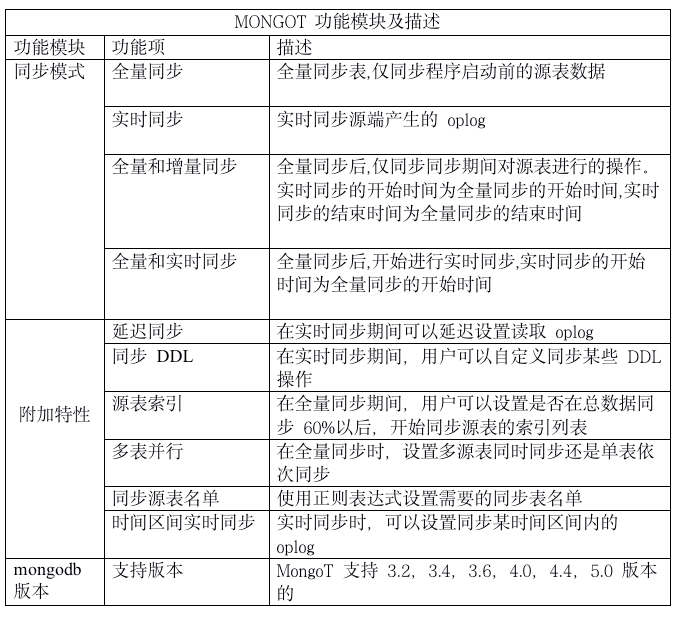
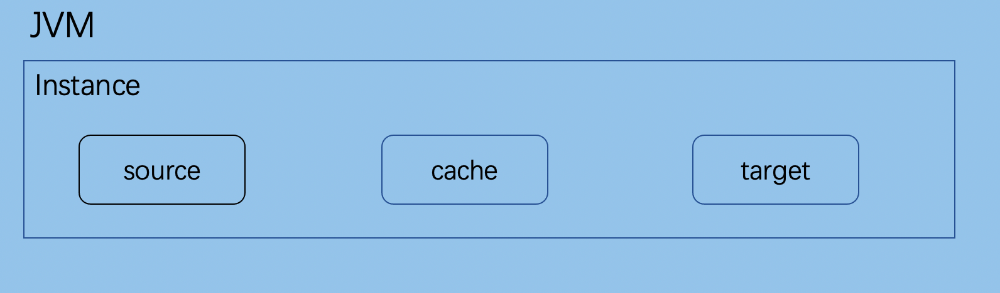
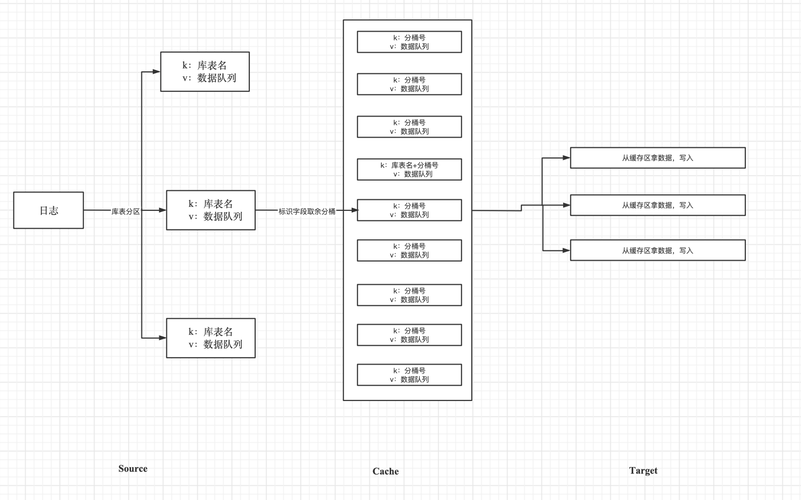
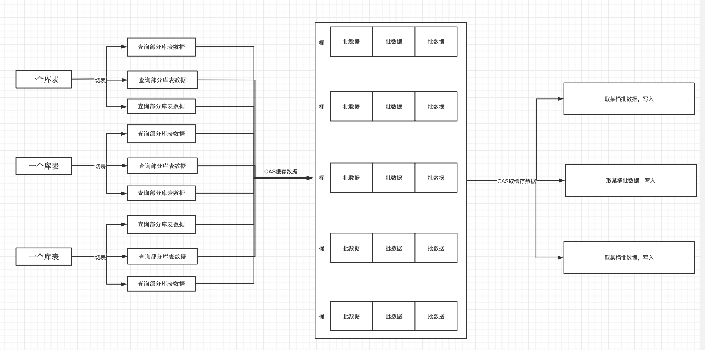

## 背景

Mongodb数据库的全量迁移和实时同步。我司研究开发新型的数据迁移项目，由此MongoT项目诞生。

## 项目介绍

名称：MongoT

语言:  纯java开发

定位:  Mongodb数据库的全量迁移和实时同步

## 项目介绍

MongoT是Mongodb数据同步组件

迁移过程包括：

1.实时迁移

2.全量迁移

3.全量实时迁移

4.全量增量迁移

## 功能介绍

## 架构

**说明:**

1. 一个Jvm Container对应多个instance，每个instance对应于一个的迁移程序
2. instance分为三部分

   a. source (从源数据库上提取数据，可分为全量/实时实现)

   b. cache  (将源库上的数据按照目标库的需求进行缓存)

   c. target (将数据更新到目标库，可分为全量/实时/对比的实现)

**MongoT流程图**

1.实时迁移

注：

使用cas机制确保每个库表在同一时刻仅有一个线程对该库表进行分桶

使用cas机制确保每个库表桶在同一时刻仅有一个线程对该库表桶的数据进行写入

当进行库表分桶时发现DDL操作时，把该DDL之前的数据进行写入，然后再执行DDL操作

2.全量迁移

注：

使用cas机制确保每个区在同一时刻仅有一个线程对该区的桶队列进行写入/读取

一个source表的数据可以放在任意区，一个target可以从任意区取数据。但一个区同时最多有一个线程进行操作

## 方案设计

[DevDesign](./04-Reference/Design.md)

## 快速开始

[QuickStart](./03-Usage/Quickstart.md)

## 相关资料

#### 公司简介

锦木信息创立于2015年，是一家专注于数据库本土化解决方案、CDN全球解决方案和全球通信解决方案的专业IT数据咨询与服务提供商。

旗下业务包括：MongoDB技术支持及咨询培训服务，Akamai全球网络性能及安全优化服务，基于Vonage的国内首个本土化通信平台JMC（锦木通信平台）和企业产品定制化业务。

锦木信息是MongoDB北亚区第一的核心合作伙伴、Akamai中国区第二的核心合作伙伴及Vonage中国区第一的核心合作伙伴。

作为以技术创新、客户为先驱动的IT服务提供商，锦木信息的产品及服务已被国内领先企业所认可，拥有 50+ 核心客户，在金融、保险、券商、游戏、电商等行业推出了优质服务和创新产品解决方案，销售业务涵盖中国大陆及中国香港。

锦木信息官网：www.jinmuinfo.com

咨询邮箱：support@jinmuinfo.com

联系电话：021-58870038 021-66696778  