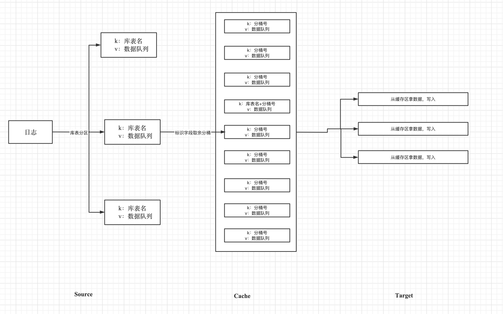
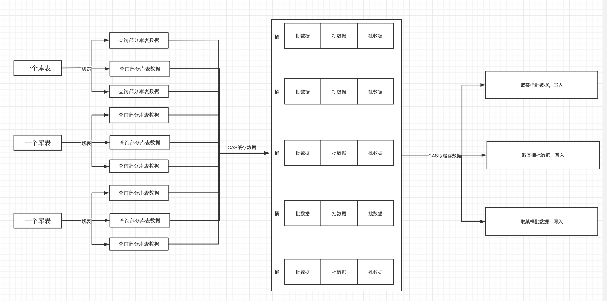

## 实时迁移

注：

使用cas机制确保每个库表在同一时刻仅有一个线程对该库表进行分桶

使用cas机制确保每个库表桶在同一时刻仅有一个线程对该库表桶的数据进行写入

当进行库表分桶时发现DDL操作时，把该DDL之前的数据进行写入，然后再执行DDL操作

**执行流程**

1.线程A读取日志文件数据,放入队列A中

2.线程B从A队列中取数据，获取数据库表名进行库表分区，且把数据放入B1,B2,B3等队列中

3.线程C1,C2,C3，从B1,B2,B3等队列取数据（利用CAS策略，确保每个B队列在同一时刻仅有一个线程读取该库表区）。取数据后，根据数据标识符，进行分桶。确保相同主键的字段放在一个桶里。
经过分桶后，把数据放入CQ1,CQ2,CQ3,CQ4队列中。若在分桶中发现DDL操作，则把该DDL之前的数据进行写入

4.线程D1,D2,D3，从CQ1,CQ2,CQ3,CQ4队列中取数据进行写入（利用CAS策略，确保每个CQ队列在同一时刻仅有一个线程读取该库表桶）

5.线程C,D可以扩充线程数

根据数据标识符:(库表名+临时分桶号)哈希取余计算

## 全量/增量迁移

注：

使用cas机制确保每个区在同一时刻仅有一个线程对该区的桶队列进行写入/读取

一个source表的数据可以放在任意区，一个target可以从任意区取数据。但一个区同时最多有一个线程进行操作

**执行流程**

*source*

1.根据source的同步表名单:dbTableWhite(正则表达式)来获取所有同步的表

2.对每个库表进行切分表。切分策略：库表数据量，_id进行计算取余

3.每个切分生成一个查询任务

4.查询出数据

5.数据放到缓存区中

*cache*

1.根据bucketNum设置缓存区个数，根据cacheBucketSize设置区的缓存桶个数，根据dataBatchSize设置每个桶的实体个数

缓存区中提供getData和putData方法，方法内部使用CAS策略，确保每个区在同一时刻仅有一个线程区使用

*target*

1.从缓存区中取数据

2.批写入数据
